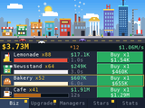

  

<h1 align="center">NumPlay</h1>

  <b>17 free games for your NumWorks calculator, in one app.</b> 
  Plus <b>Hollow Knight</b>, <b>Celeste</b> and <b>Champion Island</b>, three big games that come as apps of their own.

  
  
  

  

  <a href="#how-to-install"><b>How to install</b></a> &nbsp;·&nbsp; <a href="docs/play.md"><b>How to play</b></a> &nbsp;·&nbsp; <a href="#on-a-real-calculator"><b>See it on a real calculator</b></a>

  

  <b>New: <a href="#new-hollow-knight">Hollow Knight</a></b>, from King's Pass to Hornet in Greenpath. &nbsp;<b>And <a href="#new-numblocks">NumBlocks</a></b>, a world like Minecraft 1.8.

  NumDash, Crossy Road, NumBlocks, NumDrive, Balatro, Buckshot Roulette, Portal Returns, Tetris, Chess, Flappy Bird, Pac-Man, Snake, Connect Four, Solitaire, 2048, Minesweeper and Block Breaker, plus NumVisuals: moving backgrounds with a clock, a timer and more.

## ⭐ Enjoying NumPlay? Give it a star

NumPlay is open source and completely free, and it took a lot of work to make. If you like it, please click **Star** at the top of this page. It only takes a second, and it helps other people find NumPlay.

Want a game that isn't here? I'm open to requests: email me at [masonchen204@gmail.com](mailto:masonchen204@gmail.com).

## New: NumBlocks

  

Mine, craft and survive in a world like Minecraft 1.8, right on your calculator.

- **Endless worlds:** the same biomes, caves and trees as Minecraft 1.8.8, for any seed.
- **Survival:** chop trees, craft tools, build a shelter, and fight zombies, skeletons, creepers and spiders at night.
- **Creative:** fly around and build with every block.
- **Your worlds stay:** keep several, and they come back even after you install again.

  

  It's in NumPlay too. &nbsp;<a href="games/numblocks/README.md"><b>More about NumBlocks</b></a> &nbsp;·&nbsp; <a href="docs/play.md#numblocks"><b>How to play</b></a>

## New: Hollow Knight

  

Explore Hallownest as the Knight, right on your calculator.

- **The start of the journey:** King's Pass, Dirtmouth, the Forgotten Crossroads and Greenpath, up to Hornet.
- **The Knight moves like in the game:** the same jumps, nail slashes, pogos, dash, focus and Vengeful Spirit.
- **Its bosses and people:** the False Knight, Gruz Mother and Hornet; Elderbug, Sly, Iselda, Cornifer and more.
- **Everything to find:** geo, charms, mask shards, vessel fragments, grubs, the map and the stag stations.

  

  It fills the calculator's app space, so it comes on its own. &nbsp;<a href="games/hollowknight/README.md"><b>More about Hollow Knight</b></a> &nbsp;·&nbsp; <a href="docs/play.md#hollow-knight"><b>How to play</b></a>

## New: Celeste

  

Climb Celeste Mountain with Madeline, right on your calculator.

- **The whole climb:** the Prologue, all eight chapters, the Epilogue, and every B-side and C-side.
- **Madeline moves like in the game:** the same jumps, dashes, climbing and wall jumps.
- **The story:** every conversation with Theo, Granny, Oshiro and Badeline, with their portraits.
- **Everything to find:** strawberries, crystal hearts, cassettes and the Summit's gems.

  

  It fills the calculator's app space, so it comes on its own. &nbsp;<a href="games/celeste/README.md"><b>More about Celeste</b></a> &nbsp;·&nbsp; <a href="docs/play.md#celeste"><b>How to play</b></a>

## On a real calculator

<table>
  <tr>
    <td></td>
    <td></td>
    <td></td>
  </tr>
  <tr>
    <td></td>
    <td></td>
    <td></td>
  </tr>
</table>

Filmed on my own calculator, no emulator.

## Go support the original games!

NumPlay is a fan project, made out of love for these games and for the NumWorks calculator. It is not meant to replace any of them. If you enjoy a game here, go play the original and support the people who made it.

NumWorks also has a great community of people making games by hand, some of them over years. Go try their work too: [Numcraft](https://github.com/yannis300307/NumcraftRust), [Celeste Classic](https://github.com/BenchatonDev/Celeste-Numworks), [Tatone26's All the Apps](https://github.com/Tatone26/Numworks-games), the apps on [Nwagyu](https://nwagyu.org/guide/) and many more in [yannis300307's list](https://gist.github.com/yannis300307/9123136f90877107ec0d49ba96b303e5).

## Download

Click a file to download it. Not sure which one? Take the first.

<table>
  <tr>
    <td width="120" align="center"></td>
    <td><b><a href="https://github.com/Mason363/NumPlay/releases/latest/download/NumPlay.nwa">NumPlay.nwa</a></b> <b>All 17 games and NumVisuals in one app. Start here!</b></td>
  </tr>
  <tr>
    <td width="120" align="center"></td>
    <td><a href="https://github.com/Mason363/NumPlay/releases/latest/download/NumPlay-Invisible.nwa">NumPlay-Invisible.nwa</a> The same app, hidden. Its icon is plain white, like the calculator's home screen, and it has no name, so it looks like an empty spot.</td>
  </tr>
  <tr>
    <td width="120" align="center"></td>
    <td><a href="https://github.com/Mason363/NumPlay/releases/latest/download/NumPlay-Matrices.nwa">NumPlay-Matrices.nwa</a> The same app, in disguise. It looks like a math app called <b>Matrices</b>, next to the calculator's own apps.</td>
  </tr>
  <tr>
    <td></td>
    <td>  On the home screen: the invisible one is really there, in the empty spot after Settings. The Matrices one sits among the calculator's own apps.</td>
  </tr>
  <tr>
    <td width="120" align="center"></td>
    <td><a href="https://github.com/Mason363/NumPlay/releases/latest/download/NumDash.nwa">NumDash.nwa</a> Only NumDash: jump to the beat</td>
  </tr>
  <tr>
    <td width="120" align="center"></td>
    <td><a href="https://github.com/Mason363/NumPlay/releases/latest/download/CrossyRoad.nwa">CrossyRoad.nwa</a> Only Crossy Road: hop, dodge, survive</td>
  </tr>
  <tr>
    <td width="120" align="center"></td>
    <td><a href="https://github.com/Mason363/NumPlay/releases/latest/download/NumBlocks.nwa">NumBlocks.nwa</a> Only NumBlocks: mine, craft, survive (<a href="games/numblocks/README.md">more</a>)</td>
  </tr>
  <tr>
    <td width="120" align="center"></td>
    <td><a href="https://github.com/Mason363/NumPlay/releases/latest/download/Celeste.nwa">Celeste.nwa</a> Celeste: the whole climb up Celeste Mountain. It fills the calculator's app space, so it comes on its own, not inside NumPlay (<a href="games/celeste/README.md">more</a>)</td>
  </tr>
  <tr>
    <td width="120" align="center"></td>
    <td><a href="https://github.com/Mason363/NumPlay/releases/latest/download/HollowKnight.nwa">HollowKnight.nwa</a> Hollow Knight: from King's Pass to Hornet in Greenpath. It fills the calculator's app space, so it comes on its own, not inside NumPlay (<a href="games/hollowknight/README.md">more</a>)</td>
  </tr>
  <tr>
    <td width="120" align="center"></td>
    <td><a href="https://github.com/Mason363/NumPlay/releases/latest/download/NumDrive.nwa">NumDrive.nwa</a> Only NumDrive: drive, flip, finish</td>
  </tr>
  <tr>
    <td width="120" align="center"></td>
    <td><a href="https://github.com/Mason363/NumPlay/releases/latest/download/Balatro.nwa">Balatro.nwa</a> Only Balatro: poker hands, wild jokers</td>
  </tr>
  <tr>
    <td width="120" align="center"></td>
    <td><a href="https://github.com/Mason363/NumPlay/releases/latest/download/BuckshotRoulette.nwa">BuckshotRoulette.nwa</a> Only Buckshot Roulette: you, the Dealer, one shotgun</td>
  </tr>
  <tr>
    <td width="120" align="center"></td>
    <td><a href="https://github.com/Mason363/NumPlay/releases/latest/download/ChampionIsland.nwa">ChampionIsland.nwa</a> Champion Island: the whole island and its seven sports. It fills the calculator's app space, so it comes on its own, not inside NumPlay (<a href="games/championisland/README.md">more</a>)</td>
  </tr>
  <tr>
    <td width="120" align="center"></td>
    <td><a href="https://github.com/Mason363/NumPlay/releases/latest/download/PortalReturns.nwa">PortalReturns.nwa</a> Only Portal Returns: think with portals</td>
  </tr>
  <tr>
    <td width="120" align="center"></td>
    <td><a href="https://github.com/Mason363/NumPlay/releases/latest/download/Tetris.nwa">Tetris.nwa</a> Only Tetris: stack and clear lines</td>
  </tr>
  <tr>
    <td width="120" align="center"></td>
    <td><a href="https://github.com/Mason363/NumPlay/releases/latest/download/NumChess.nwa">NumChess.nwa</a> Only Chess: bots, puzzles, 2 players</td>
  </tr>
  <tr>
    <td width="120" align="center"></td>
    <td><a href="https://github.com/Mason363/NumPlay/releases/latest/download/FlappyBird.nwa">FlappyBird.nwa</a> Only Flappy Bird: flap through the pipes</td>
  </tr>
  <tr>
    <td width="120" align="center"></td>
    <td><a href="https://github.com/Mason363/NumPlay/releases/latest/download/PacMan.nwa">PacMan.nwa</a> Only Pac-Man: eat dots, dodge ghosts</td>
  </tr>
  <tr>
    <td width="120" align="center"></td>
    <td><a href="https://github.com/Mason363/NumPlay/releases/latest/download/Snake.nwa">Snake.nwa</a> Only Snake: Google's snake, with its 12 modes</td>
  </tr>
  <tr>
    <td width="120" align="center"></td>
    <td><a href="https://github.com/Mason363/NumPlay/releases/latest/download/ConnectFour.nwa">ConnectFour.nwa</a> Only Connect Four: four in a row wins, against a friend or the computer</td>
  </tr>
  <tr>
    <td width="120" align="center"></td>
    <td><a href="https://github.com/Mason363/NumPlay/releases/latest/download/Solitaire.nwa">Solitaire.nwa</a> Only Solitaire: the classic card game, the way Google plays it</td>
  </tr>
  <tr>
    <td width="120" align="center"></td>
    <td><a href="https://github.com/Mason363/NumPlay/releases/latest/download/2048.nwa">2048.nwa</a> Only 2048: slide, merge, reach 2048</td>
  </tr>
  <tr>
    <td width="120" align="center"></td>
    <td><a href="https://github.com/Mason363/NumPlay/releases/latest/download/Minesweeper.nwa">Minesweeper.nwa</a> Only Minesweeper: clear the field, flag the mines</td>
  </tr>
  <tr>
    <td width="120" align="center"></td>
    <td><a href="https://github.com/Mason363/NumPlay/releases/latest/download/BlockBreaker.nwa">BlockBreaker.nwa</a> Only Block Breaker: break every brick, set off the power-ups</td>
  </tr>
  <tr>
    <td width="120" align="center"></td>
    <td><a href="https://github.com/Mason363/NumPlay/releases/latest/download/NumTycoon.nwa">NumTycoon.nwa</a> NumTycoon: build a business empire, hire managers, franchise for stars. NumPlay's space on the calculator is full: install it on its own</td>
  </tr>
  <tr>
    <td width="120" align="center"></td>
    <td><a href="https://github.com/Mason363/NumPlay/releases/latest/download/NumVisuals.nwa">NumVisuals.nwa</a> Only NumVisuals: backgrounds, clocks, timers</td>
  </tr>
</table>

The first three are the same app with the same games: only the icon and the name change. Your progress is saved on the calculator either way.

## How to install

You need your calculator, its USB cable, and a computer with **Google Chrome** or **Microsoft Edge**. It takes about 2 minutes.

1. **Download** a file from the table above. It goes to your Downloads folder.
2. **Plug** your calculator into the computer and turn it on.
3. **Go to** [my.numworks.com/apps](https://my.numworks.com/apps) and log in. No account? Sign up there, it's free.
4. Click **Connect**, then pick your calculator in the small window that opens.
5. **Add** the file you downloaded, then click **Install**. Keep the calculator plugged in until it's done.
6. **Play!** On your calculator, press the **Home** key (the little house), go to the end of the apps and open **NumPlay**.

> [!TIP]
> **Updating?** Install the new file the same way. Your progress comes back by itself: NumPlay keeps a copy of it in a Python script called `numplay_saves.py`, the one kind of file the website keeps. (This works for updates from version 1.2.1 on.)
>
> Already have other apps from that website? It swaps them for the new ones, so add them again in step 5 to keep them. The calculator's own apps are never touched.
>
> Nothing happens when you plug it in? Try another cable: some only charge.

## Gameplay

<table>
  <tr>
    <td></td>
    <td></td>
  </tr>
  <tr>
    <td></td>
    <td></td>
  </tr>
  <tr>
    <td></td>
    <td></td>
  </tr>
  <tr>
    <td></td>
    <td></td>
  </tr>
  <tr>
    <td></td>
    <td></td>
  </tr>
  <tr>
    <td></td>
    <td></td>
  </tr>
  <tr>
    <td></td>
    <td></td>
  </tr>
  <tr>
    <td></td>
    <td></td>
  </tr>
  <tr>
    <td></td>
    <td></td>
  </tr>
  <tr>
    <td></td>
    <td></td>
  </tr>
  <tr>
    <td></td>
    <td></td>
  </tr>
  <tr>
    <td></td>
    <td></td>
  </tr>
  <tr>
    <td></td>
    <td></td>
  </tr>
  <tr>
    <td></td>
    <td></td>
  </tr>
</table>

## Acknowledgements

- **[Tatone26](https://github.com/Tatone26/Numworks-games)**'s **All the Apps** inspired NumPlay's list of classics. Flappy Bird, Pac-Man, Snake, Connect Four, Solitaire and 2048 are written in C for NumPlay and keep its options, with no code copied from it. Tetris is Tatone26's own, which they released into the public domain, adapted for NumPlay.
- **[Gabriele Cirulli](https://github.com/gabrielecirulli/2048)** made 2048.
- Snake, Solitaire and Block Breaker look and play like **Google's games** in Search. They are drawn from scratch; nothing is taken from Google.
- **[gd3ds](https://github.com/AleFunky/gd3ds)** by AleFunky and friends, whose research into Geometry Dash made NumDash possible. Clubstep, Deadlocked and Dash also rely on [gdsolver](https://github.com/gdsolver/gdsolver)'s measurements of Geometry Dash 2.2, level data from [gmdkit](https://github.com/UHDanke/gmdkit) by HDanke and checks against [GDRWeb](https://github.com/iliasHDZ/GDRWeb) by IliasHDZ.
- **Balatro** by LocalThunk inspired NumPlay's Balatro, which uses art adapted from the game and the **m6x11** font by Daniel Linssen.
- **Minecraft** by Mojang inspired NumBlocks, which uses Minecraft 1.8.8's textures, font and screens and makes its worlds the way Minecraft 1.8.8 does.
- **Celeste** inspired NumPlay's Celeste, which uses the game's own pictures, maps, texts and fonts. Not affiliated with Maddy Makes Games.
- **Hollow Knight** inspired NumPlay's Hollow Knight, which uses the game's own pictures, animations, maps, texts and fonts. Not affiliated with Team Cherry.
- **Buckshot Roulette** by Mike Klubnika inspired NumPlay's Buckshot Roulette, whose scenes are rendered from the game through the Open Buckshot Roulette project (1503Dev). Fonts: Fake Receipt by Ray Larabie and Dot Matrix by Dionaea.
- The **Doodle Champion Island Games** (2021) inspired Champion Island, which uses the doodle's own pictures, maps and texts from the [Google-Doodle-Champion-Island](https://github.com/potherca-blog/Google-Doodle-Champion-Island) archive by potherca-blog, and the **PixelMplus** font by Itou Hiroki ([license](LICENSES/PixelMplus.txt)).
- **[Portal Returns](https://www.cemetech.net/downloads/files/1313/x1313)** by MateoConLechuga for the TI-84 Plus CE, with sprites by CKH4 and Portal Prelude chambers ported by Unicorn from BuilderBoy's original.
- The **Nunito** and **Rammetto One** fonts, under the SIL Open Font License ([LICENSES](LICENSES)).
- **reversal_lava63**, a beta tester who plays NumPlay's apps on a real calculator and reports what's wrong.

## License

NumPlay is licensed under the [GNU General Public License v3.0](LICENSE). Copyright (c) 2026 Mason Chen.

Code and fonts from others keep their own licenses: the `UNLICENSE` files in the games' folders and the [LICENSES](LICENSES) folder. The names, artwork and music of the games NumPlay is inspired by belong to their makers and are not covered by it.

Unofficial fan games, not affiliated with NumWorks, RobTop Games (Geometry Dash), Hipster Whale (Crossy Road), the makers of Drive Mad, LocalThunk or Playstack (Balatro), Mike Klubnika or Critical Reflex (Buckshot Roulette), Mojang or Microsoft (Minecraft), Maddy Makes Games (Celeste), Team Cherry (Hollow Knight), MateoConLechuga (Portal Returns), Valve (Portal), .GEARS (Flappy Bird), Bandai Namco (Pac-Man), Hasbro (Connect Four), Google (Snake, Solitaire, Block Breaker, Doodle Champion Island Games), STUDIO4°C or Microsoft (Minesweeper). Tetris is a trademark of The Tetris Company, Minecraft of Mojang Synergies AB, Pac-Man of Bandai Namco and Connect Four of Hasbro.
