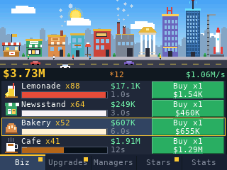

# NumTycoon

A business tycoon for the NumWorks calculator. Start with a lemonade stand and $4, and grow a living pixel city with ten businesses, from the newsstand to a space port that launches a rocket with every sale.

- **10 businesses:** Lemonade, Newsstand, Bakery, Cafe, Restaurant, Factory, Bank, Hotel, Tech Lab and Space Port. Each one costs more with every copy you own, pays more, and takes longer to sell.
- **A city that lives:** every business is drawn in the city and grows with its level (flags, gold trim, crowns). It has a sky with a sun and a moon, sunrise and sunset, stars, clouds, rain showers, windows that light up at night, cars with headlights, walkers, smoking chimneys, a crane over the next empty lot and a rocket that takes off at the Space Port.
- **Run it by hand, or hire a manager:** press EXE to start a sale; a manager (10 of them, each with a name) runs a business on his own, and catches up on every sale it missed.
- **Milestones:** a business doubles its profit at 25, 50, 100, 200, 300 ... 1000 copies.
- **38 upgrades:** three x3 upgrades for each business, and eight upgrades for all of them, up to x10.
- **Golden truck:** it drives through the city now and then. Catch it with Shift for a big delivery, profit x7, sales 3x faster, or a few stars.
- **Franchise:** from $1T earned, reset your empire for **Stars**: each one is +2% profit for good. Spend them in the Stars tab: more starting cash, cheaper businesses, more trucks, +50% profit, faster sales.
- **20 achievements** (each +1% profit), a Stats tab, buy x1 / x10 / x100 / Max, and game speed x1, x2 or x5.
- **Optimized:** the city is composed in 12-row bands and the interface uses dirty rows (a row is pushed only when it changes, a progress bar only repaints the pixels that moved), at 30 frames a second. It needs about 27 KB of RAM and 26 KB of flash. Particles, rain and the day and night can be turned off in the options.
- **Saved by itself** every 15 seconds and when you quit, with the calculator's file system (`tycoon.sav`, 168 bytes).

## Controls

| Key | Action |
| --- | --- |
| Up, Down | Pick a line (hold to scroll) |
| Left, Right, or 1 to 5 | Change tab: Biz, Upgrades, Managers, Stars, Stats |
| OK | Buy the line (a business, an upgrade, a manager, a star upgrade, Franchise) |
| EXE (or 6) | Run a sale by hand |
| Backspace (or Alpha) | Buy x1, x10, x100 or Max |
| Shift (or 0) | Catch the golden truck |
| Back | Pause (Resume, Options, How to play, Save & quit); back in menus |
| Home | Quit |

## Tests

`make host` builds the real game code against a fake screen and keyboard (`test/host.c`) with AddressSanitizer: scripted sessions, screenshots (PPM), a save that is reloaded, a bot that plays for hours to check the pace of the game, and random key presses. Run `output/host/host SCRIPT OUTDIR` (see the header of `test/host.c` for the script lines). The calculator build is played in the ARM emulator by `tests/test_games.py`, like the other games.

Build: `make` (needs `arm-none-eabi-gcc` and Node.js for nwlink). Inside NumPlay it is built by the top-level `make`.

## Credits

An original game, drawn from shapes as it goes: its idea (businesses, managers, milestones, prestige) is the classic idle tycoon, and it uses no image or code from any other game. Written in C for NumPlay.
